# Addendum : Enviroment Creation

## Introduction
This addendum contains environment creation instructions.


## Task: Material and software download

1. Download from provided link all materials in WORK_DIRECTORY
    The materials include:
    * lectures slides in pdf
    * lab guide in pdf
    * configure_labs.sh script    

2. Connect to https://edelivery.oracle.com and login with your account

    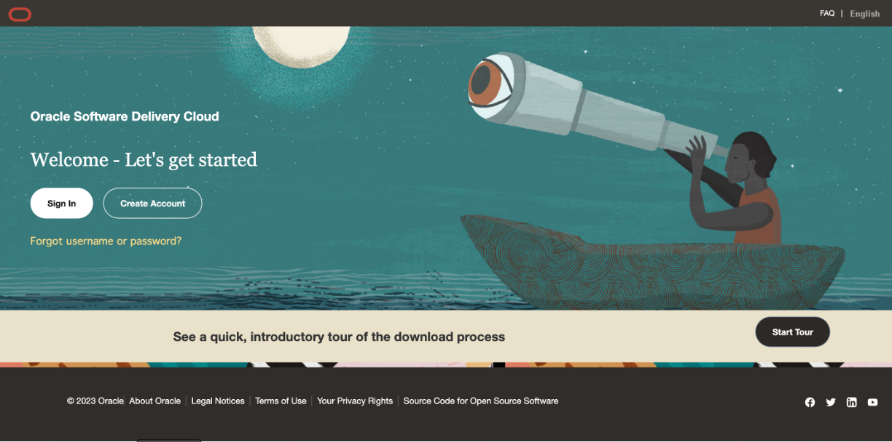

3. In the text box insert “MySQL Enterprise Edition” and then click on “DLP: MySQL Enterprise Edition (MySQL Enterprise Edition)” to add it to cart 
    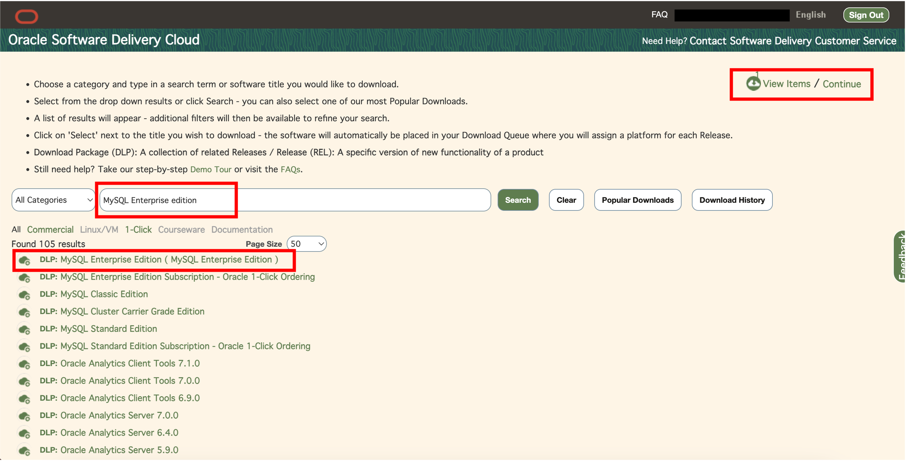

4. Deselect "MySQL Installer 8..."
5. Select for MySQL Server 8... the platform "Linux x86-64"
    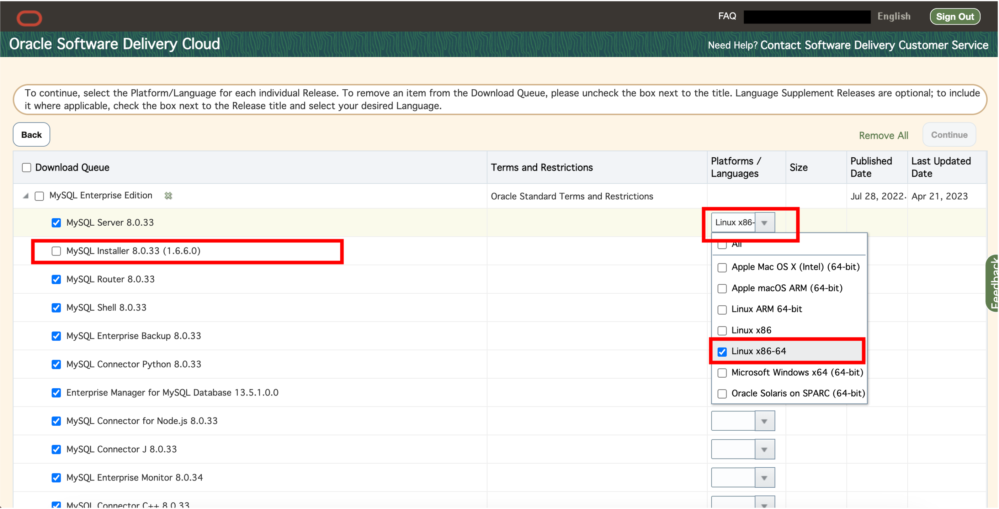

6. All the software automatically add the Linux x86-64 platform and the button. Click now the button “Continue” now enabled
    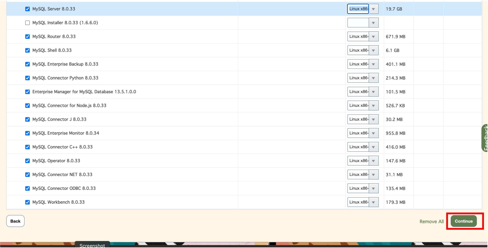

7. Read and accept the Terms and restrictions and click “Continue”
    

    Download the software that you need, at least
    * MySQL Commercial Server 8.0.xx TAR for Generic Linux x86 (64bit)
    * MySQL Database/Components 8.0.xx Yum Repository TAR for Oracle Linux / RHEL 8 x86 (64bit)
        * That contains all the rpms
    * MySQL Enterprise Monitor Service Manager 8.0.xx for Linux x86 (64-bit)
    * MySQL Enterprise Monitor Agent 8.0.xx for Linux x86 (64-bit)

9. Create a /workshop directory in each server
10. Copy the software in each server or (optionally) create an NFS share
    * For NFS configuration refer to linux manuals

    To use an NFS share, don’t forget to open on Public Subnet these ports
    * Ingress Rules
    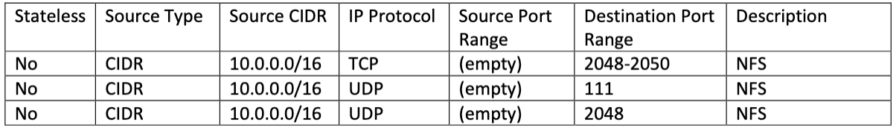

    * Outgress Rules
    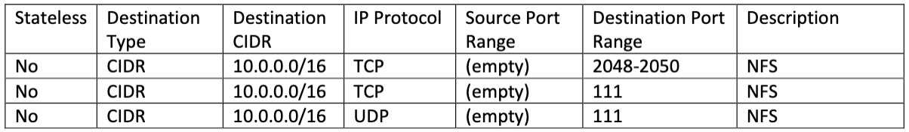

> **Note:** This is the list of binaries used in the labs. Where  <span style="color:red">XX</span> is the actual release.
  * MySQL Community Yum Repository: 
      * mysql80-community-release-el7-3.noarch.rpm
  * MySQL Enterprise Server: 
      * mysql-commercial-8.0.<span style="color:red">XX</span>-el7-x86_64.tar.gz
  * MySQL Enterprise Shell: 
      * mysql-shell-commercial-8.0.<span style="color:red">XX</span>-1.1.el7.x86_64.rpm
  * MySQL Enterprise Client
      * mysql-commercial-client-8.0.<span style="color:red">XX</span>.el7.x86_64.rpm
      * mysql-commercial-common-8.0.<span style="color:red">XX</span>.el7.x86_64.rpm
      * mysql-commercial-libs-8.0.<span style="color:red">XX</span>.el7.x86_64.rpm
      * mysql-commercial-libs-compat-8.0.<span style="color:red">XX</span>.el7.x86_64.rpm
  * MySQL Enterprise Monitor:
     * mysqlmonitor-8.0.<span style="color:red">XX</span>-linux-x86_64-installer.bin
     * mysqlmonitoragent-8.0.<span style="color:red">XX</span>-linux-x86-64bit-installer.bin
  * MySQL Enterprise Router: 
     * mysql-router-commercial-8.0.<span style="color:red">XX</span>.el7.x86_64.rpm
     
>  Sample databases are downloadable from here
   * World database: https://downloads.mysql.com/docs/world-db.zip
   * Employees database: https://github.com/datacharmer/test_db/archive/refs/heads/master.zip
       
    
## Task: Create a VCN
> **Note:**
 * It’s recommended to use an empty trial environment or a dedicated compartment inside Oracle Cloud Infrastructure (OCI) with administrative privileges access
 * For more information on Oracle Cloud Console, please visit: https://docs.cloud.oracle.com/iaas/Content/GSG/Concepts/console.htm

1. Sign in to Oracle Cloud, please visit https://www.oracle.com/cloud/sign-in.html, enter your Cloud Account (tenancy name)
    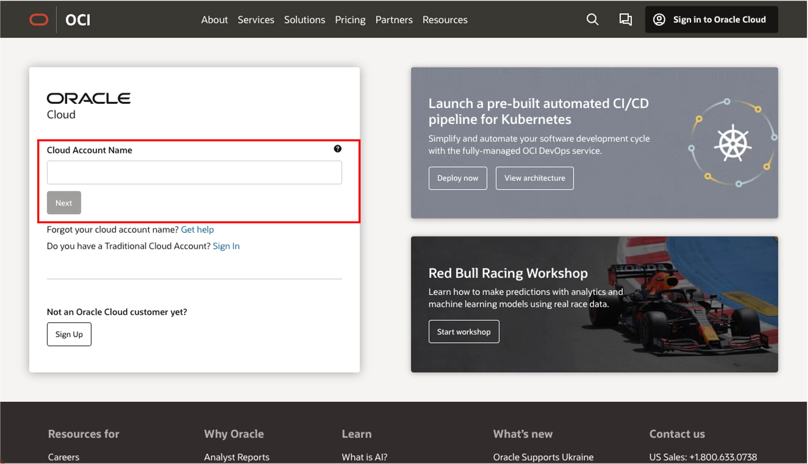

2. On Oracle Cloud Account Sign in, enter User Name, that is the e-mail address provided on Exercise 1, and Password created and click on Sign in.
    
    
3. When you sign in to the Oracle Cloud you'll see the Console home page. Use the navigation menu in the upper left to navigate to the service pages where you create, manage, and view the cloud resources.
    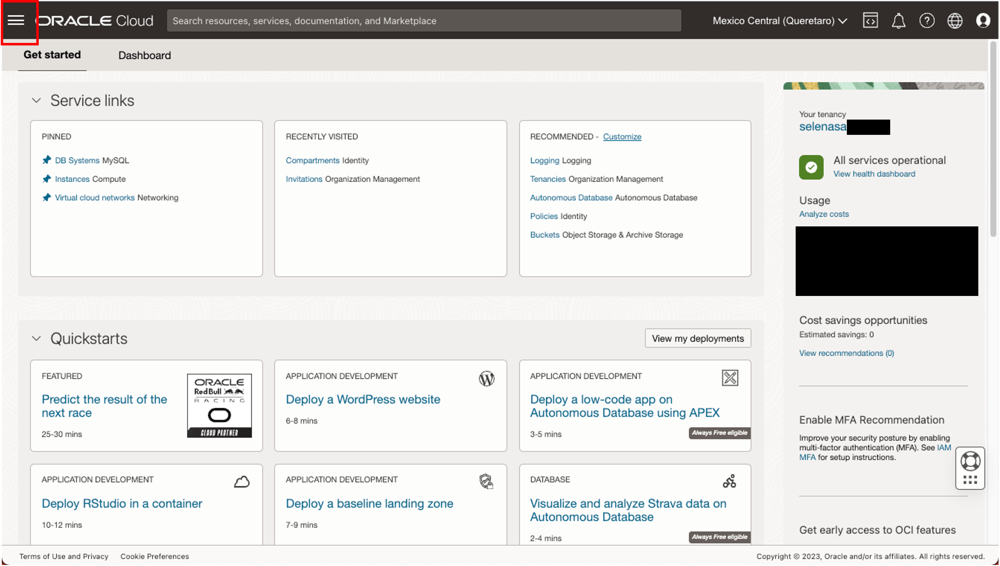


4. Choose your compartment.
    If your tenancy is empty, you can use root compartment, otherwise we suggest you to create a dedicated compartment for the bootcamp. For the instructions read the addendum.

5. We create now the VCN
6. On the Navigation Menu, select Networking -> Virtual Cloud Networks.
    

7. Click on Start VCN Wizard.
    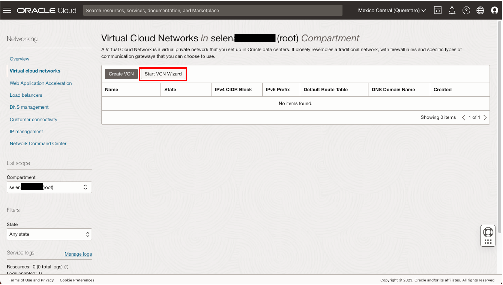

8. On Start VCN Wizard, select VCN with Internet Connectivity and click the button “Start VCN Wizard”. 
    If you don’t see the button, select in the left menu the Compartment “(root)”.
    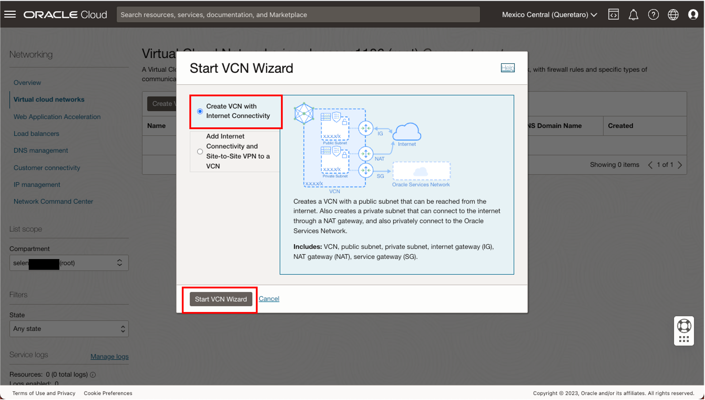
9. On Basic Information, enter the following information and then click Next
    

    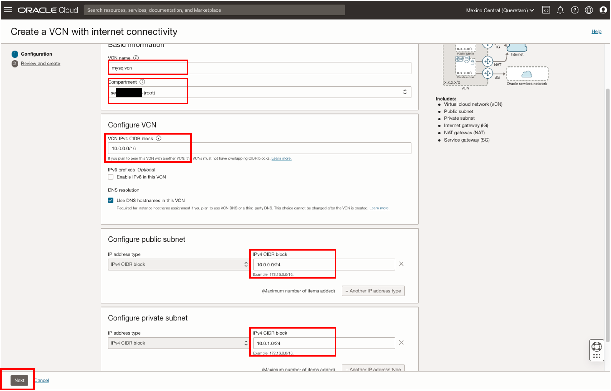

10. Under Review and Create, review the Oracle Virtual Cloud Network (VCN) and Subnets information and click on Create. 
    As you see, you can customize the VCN with route tables and security lists.
    We do this later to show you how to modify the VCN when it’s created.

    Click Create button to create the VCN.
    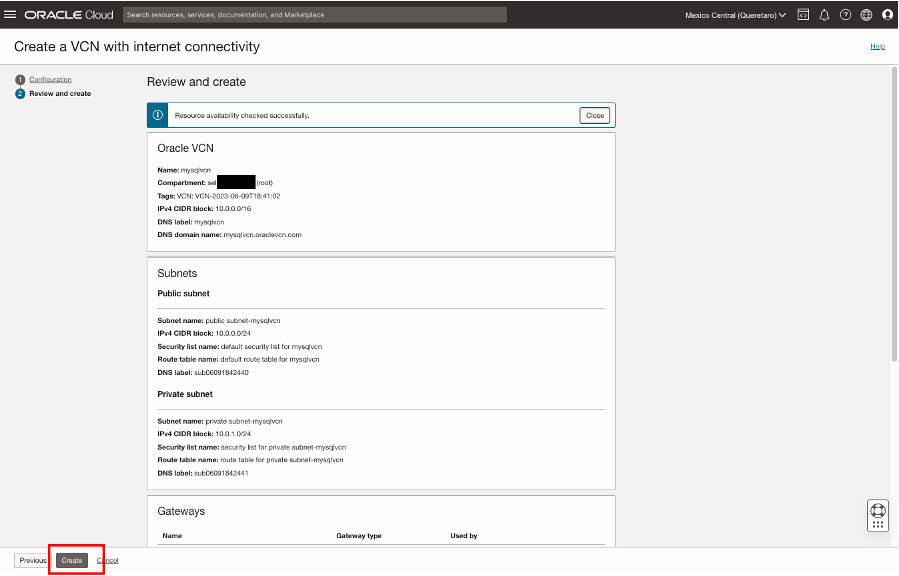

11. The Virtual Cloud Network creation is done.
12. Click "View Virtual Cloud Network" button to display the created VCN

    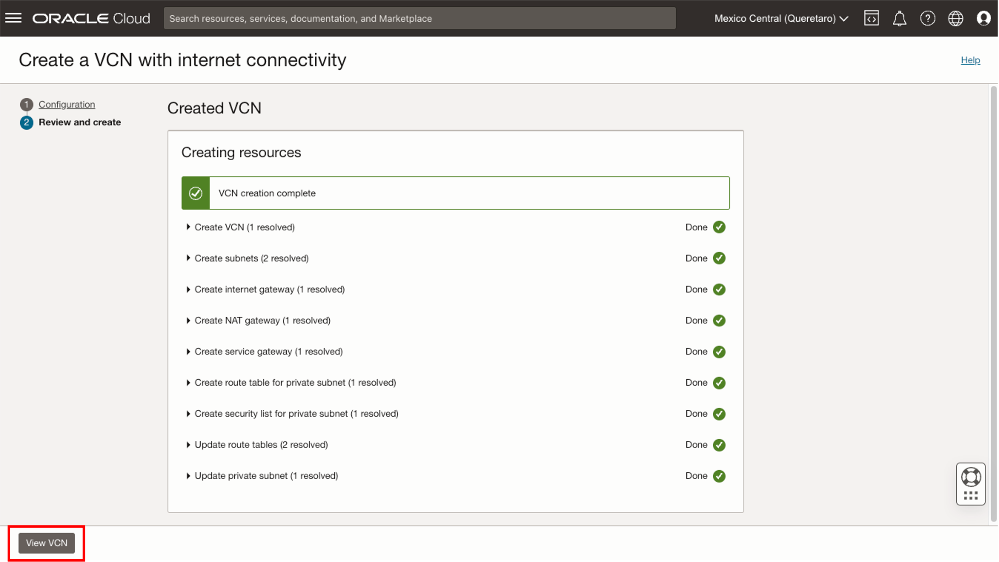


## Task: Application server creation and test
> **Note:**
 * The application server is called “app-srv”, MySQL servers are called myslqX
 * Compute instances have by default the user “opc” without password. 
 * It’s mandatory to use an SSH key file to access the instance
 * Linux opc user has limited privileges. To work with administrative privileges, use "sudo" like shell> sudo su - root

1. On the navigation Menu, click on Compute -> Instances
    

2. Click on “Create Instance”
    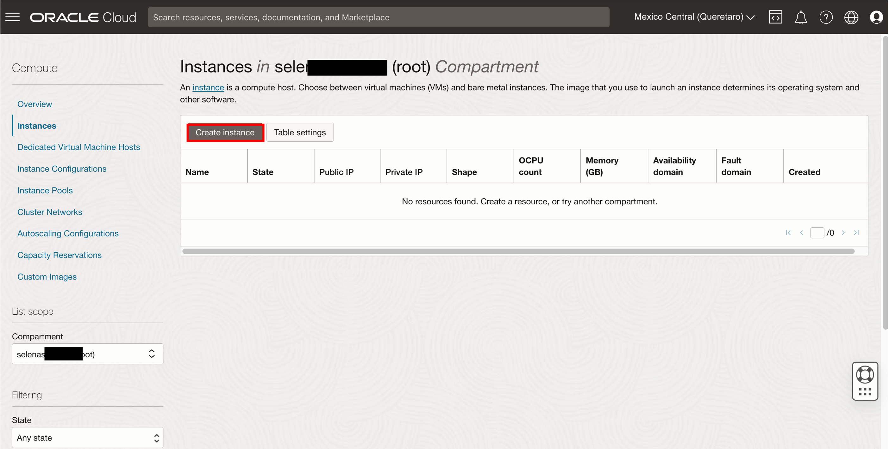

3. On Create Compute Instance, enter:
    ```
    Name: <copy>app-srv</copy>
    ```
    * Create in compartment: (keep the root compartment or choose your own)
    * Placement: (keep the default)
    * Image and shape:
        * Image:
            * click “Edit”
            * then "Change image”
            * Insert:
                * Image name: Oracle Linux
                * OS version: 8
            * Then click “Select Image”
        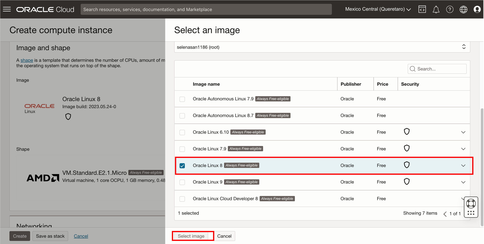
        * Shape:
            * click "Change shape”
            * Insert:
                * Instance type: Virtual machine
                * Shape series: AMD
                * Shape name: VM.Standard.E4.Flex or VM.Standard.E3.Flex
                * Number of OCPUs: 1
                * Amount of memory: 8GB
            * Then click “Select shape”
        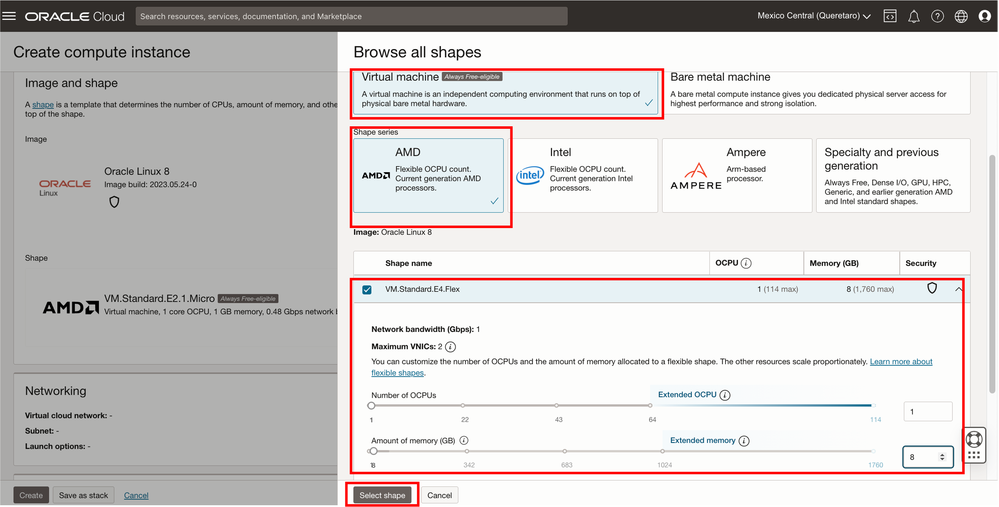

        * Networking:
            * Virtual Cloud Network: mysqlvcn (the default)
            * Subnet: Public Subnet-mysqlvcn (regional) (the default) 
            *Public IP address: Assign a public IPv4 address (the default)

        * Add SSH keys: keep the default "Generate a key pair for me" and then click the button "Save Private Key“. Please save the file in our previously created directory WORK_DIRECTORY

        

4. We are now ready to start the creation, so click on button “Create”.
5. The New Virtual Machine is now in PROVISIONING.
    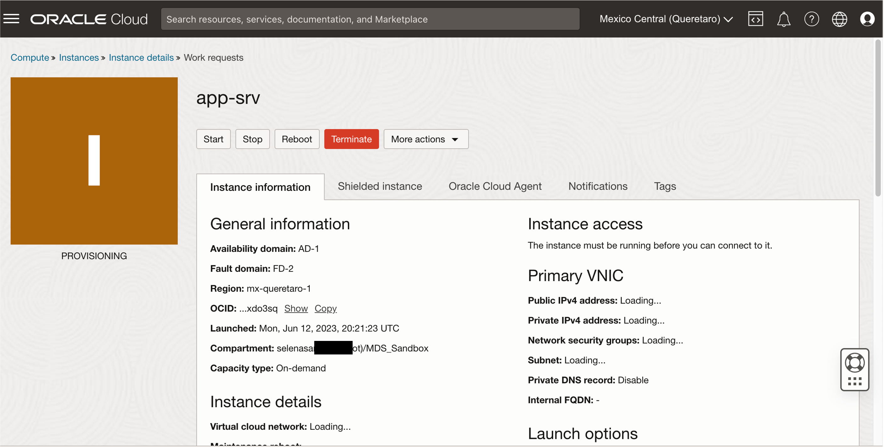

6. Wait that the status change to RUNNING. 
    
    The instance is now ready to be used. In the recap you see the public IP address to use in next steps. Make sure to write it down.
    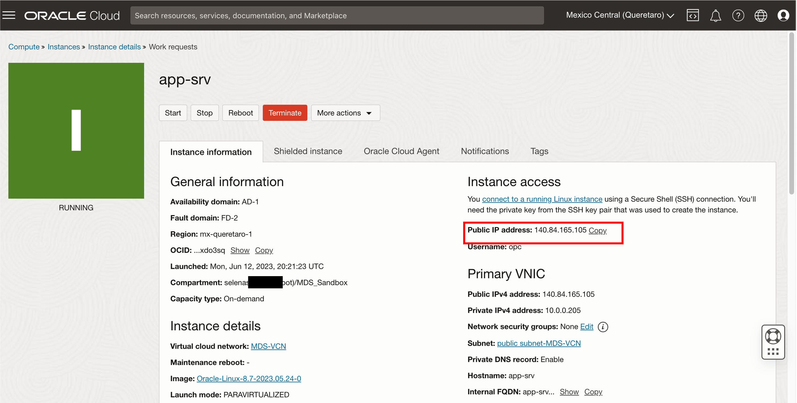

7. Now we can test the connection to app-srv

8. Using your ssh client (e.g. from bash shell or Windows Powershell on your local system) connect to the Compute with these parameters:
    * User: opc
    * Private key: the file downloaded during the instance creation 
    * Connection address: public IP of the compute machine. It’s shown in the instances summary or Instance details.

    The command will look like: 
    ```
    <copy>ssh -i <private_key_file> opc@<your_compute_instance_ip></copy>
    ```
    For example:

    <span style="color:green">shell></span> ssh -i ssh-key-2022-01-10.key opc@132.145.170

9. To simplify the labs, disable firewall and selinux (not recommended in production)
    ```
    <span style="color:green">shell-app-srv$</span><copy>sudo systemctl stop firewalld</copy>
    ```
    ```
    <span style="color:green">shell-app-srv$</span><copy>sudo disable stop firewalld</copy>
    ```
    ```
    <span style="color:green">shell-app-srv$</span><copy>sudo systemctl stop firewalld</copy>
    ```
    ```
    <span style="color:green">shell-app-srv$</span><copy>sudo setenforce 0</copy>
    ```
10. Repeat the steps to create 3 additional server, where:
    * Hostname is mysql1, mysql2 and mysql3
    * Subnet is the private one


## Task: Open subnet ports to access MySQL
> **Note:**
 * We have an installation on standard port (3306 and 33060). In the lab create an instance on 3307/33070, so we need to open the access
 * The security by default approach of OCI, means that connect services between subnets requires to open the dedicated ports. This can be achieved using Security lists (https://docs.oracle.com/en- us/iaas/Content/Network/Concepts/securitylists.htm) or Network security groups (https://docs.oracle.com/en- us/iaas/Content/Network/Concepts/networksecuritygroups.htm#Network_Security_Groups).
 * In this workshop we use Security lists

1. Login in your OCI tenancy dashboard
2. If are using a dedicated compartment, select it
3. On the Navigation Menu, select Networking -> Virtual Cloud Networks.
    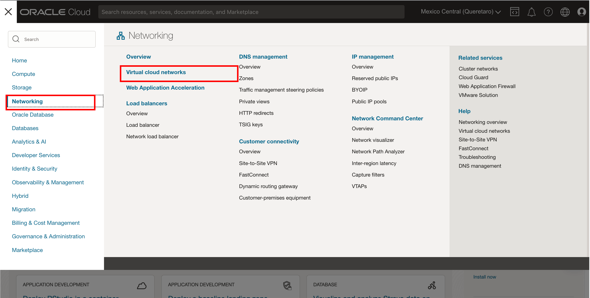

4. Select mysqlvcn
    

5. Select “Security Lists” from left side menu
    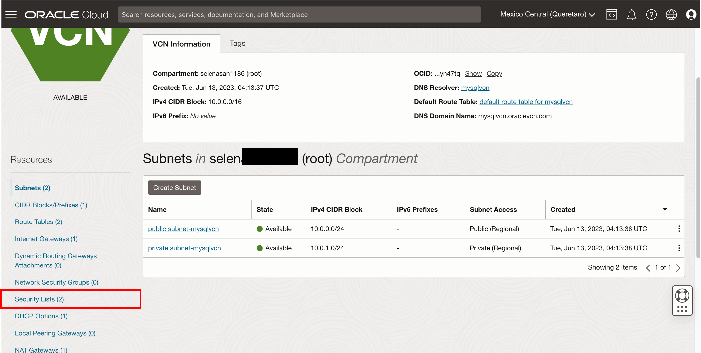

6. Select “Security List for Private Subnet-mysqlvcn” security list.
    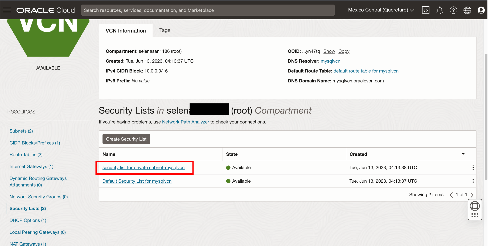

7. Click the button “Add Ingress Rules”
    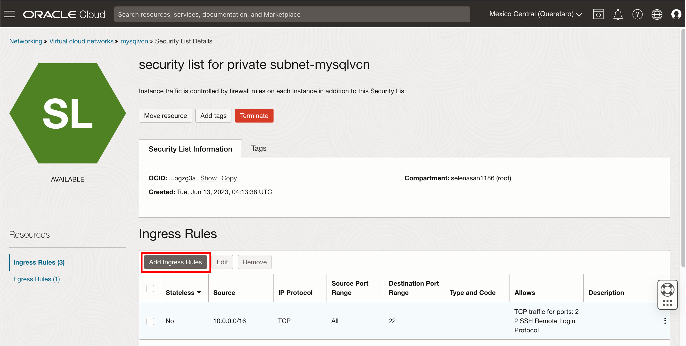

8. In the form insert these values then add a new line with the button “+ Another Ingress rule”
    * Source: CIDR 
    ```
    Source CIDR: <copy>10.0.0.0/16</copy>
    ```
    * IP Protocol: TCP
    * Source Port Range: (leave it empty)
    ```
    Destination port range: <copy>3306,33060</copy>
    ```
    ```
    Description: <copy>Default MySQL ports</copy>
    ```

    

9. In the new line add these values then confirm with the button “Add Ingress Rules”
    * Source: CIDR 
    ```
    Source CIDR: <copy>10.0.0.0/16</copy>
    ```
    * IP Protocol: TCP
    * Source Port Range: (leave it empty)
    ```
    Destination port range: <copy>3307,33070</copy>
    ```
    ```
    Description: <copy>MySQL ports for custom installation</copy>
    ```
    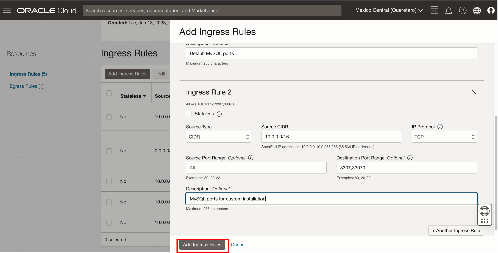

## Task: Open subnet ports for MySQL InnoDB Cluster
> **Note:**
 MySQL Cluster use XCom protocol with default port calculated like target instance's port value by 10 and then adding one to the result. So we need to open port 33071

1. Login in your OCI tenancy dashboard
2. If are using a dedicated compartment, select it
3. In the Navigation Menu, select Networking -> Virtual Cloud Networks.
    

4. Select mysqlvcn
    

5. Select “Security Lists” from left side menu
    

6. Select “Security List for Private Subnet-mysqlvcn” security list.
    

7. Click the button “Add Ingress Rules”
    
8. In the form insert these values and then confirm
    * Source: CIDR 
    ```
    Source CIDR: <copy>10.0.1.0/24</copy>
    ```
    * IP Protocol: TCP
    * Source Port Range: (leave it empty)
    ```
    Destination port range: <copy>33071</copy>
    ```
    ```
    Description: <copy>MySQL Group Replication</copy>
    ```

    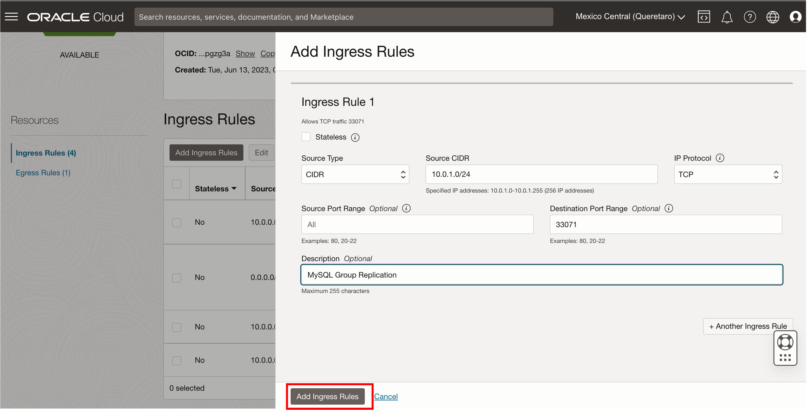

## Task: Open subnet ports for MySQL Enterprise Monitor
> **Note:**
 * Here, we open the MySQL Enterprise Monitor port (18443) from internal subnet and internet
 * We use Security Lists

1. Login in your OCI tenancy dashboard
2. If are using a dedicated compartment, select it
3. On the Navigation Menu, select Networking -> Virtual Cloud Networks.
    

4. Select mysqlvcn
    

5. Select “Security Lists” from left side menu
    

6. Setup script create a dedicated security list for app-srv. We use it now. Select “app-srv_sl” security list.
    
7. Click the button “Add Ingress Rules”
    
8. In the form insert these values and then confirm
    * Source: CIDR 
    ```
    Source CIDR: <copy>0.0.0.0/0</copy>
    ```
    * IP Protocol: TCP
    * Source Port Range: (leave it empty)
    ```
    Destination port range: <copy>18443</copy>
    ```
    ```
    Description: <copy>MySQL Enterprise Monitor</copy>
    ```

    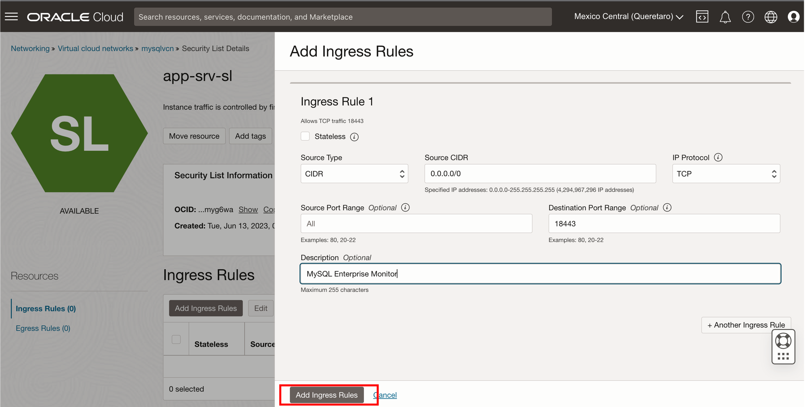

9. Now we have a rule that let connect to our MySQL Enterprise Monitor service
    
    

## Acknowledgements
* **Author** - Marco Carlessi, Principal Sales Consultant
* **Contributors** -  Perside Foster, MySQL Solution Engineering, Selena Sánchez, MySQL Solutions Engineer
* **Last Updated By/Date** - Selena Sánchez, MySQL Solution Engineering, May 2023