# MySQL Enterprise Monitor

## Introduction
This addendum contains additional information and troubleshooting guides. 


## Task: Content of file my.cnf mysql1

 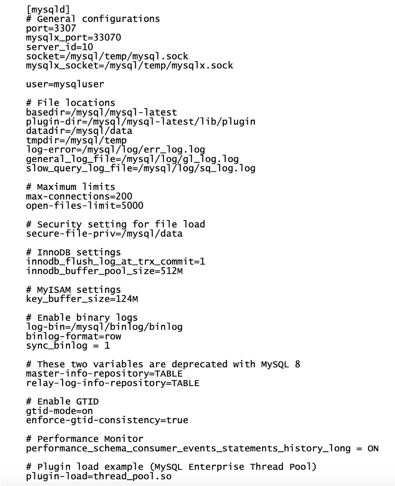

## Task: Content of file my.cnf mysql2

  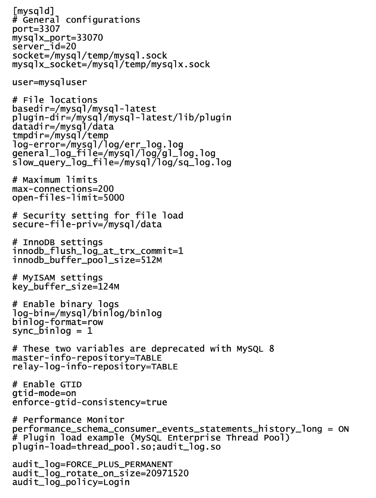

## Task: Content of file my.cnf mysql3

  

## Task: Content of mysqld-advanced

 

## Task: Content of file mysqlbackup\_user\_grants

 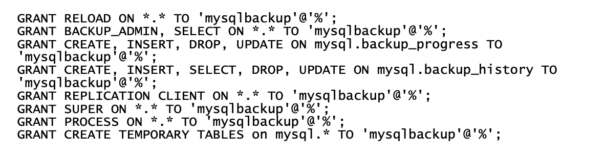

## Task: Putty configuration 
 Steps to configure putty connection to OCI compute instances.
1. Open putty
2. Insert the public IP of your server and a mnemonic session name
    
3. Choose "Connection→SSH→Auth" and provide the id_rsa.ppk path
    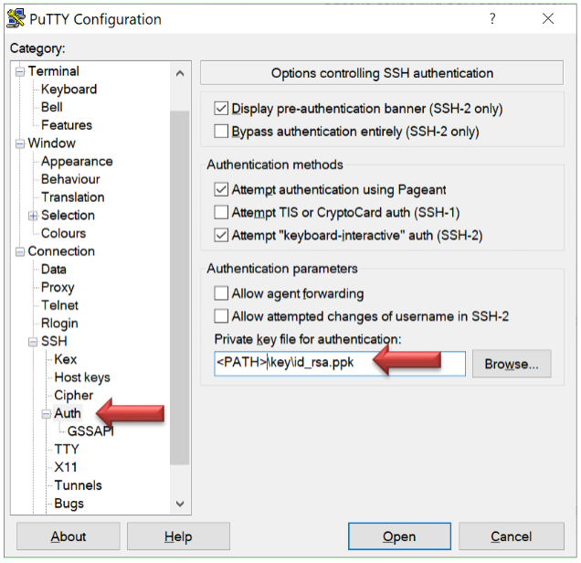

4. Select "Connection→Data" and insert "opc" in "Auto-login username"
    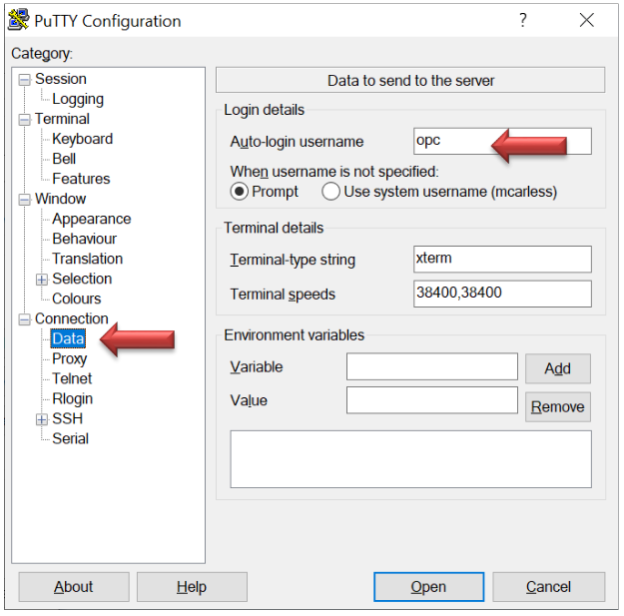

5. Choose Connection and insert "60" in "Seconds between keepalives"
    

6. Return to "Session" and click save
    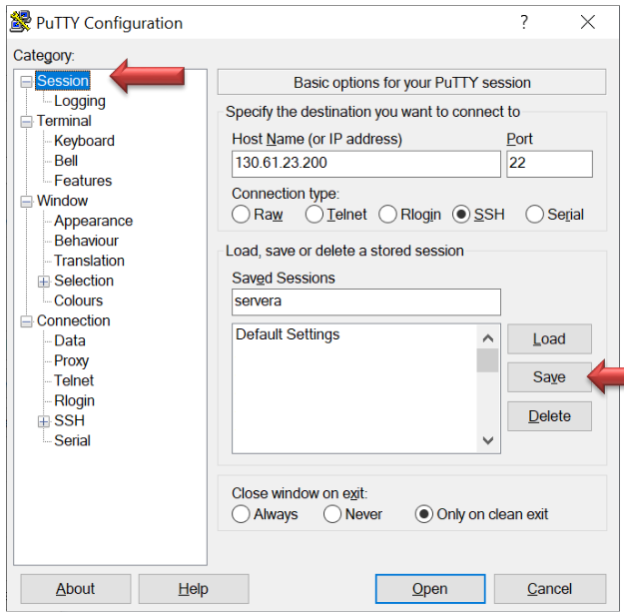


## Task: How to create and use Compartments 
> **Note:**
 * Two Compartments, named Oracle Account Name (root) and a compartment for PaaS, were
automatically created by the Oracle Cloud
 * For more information on Managing Compartments, please visit:
https://docs.cloud.oracle.com/iaas/Content/Identity/Tasks/managingcompartments.htm.

1. Login in your OCI tenancy dashboard
2. On the Navigation Menu, under “Identity and Security”, select Identity -> Compartments.
    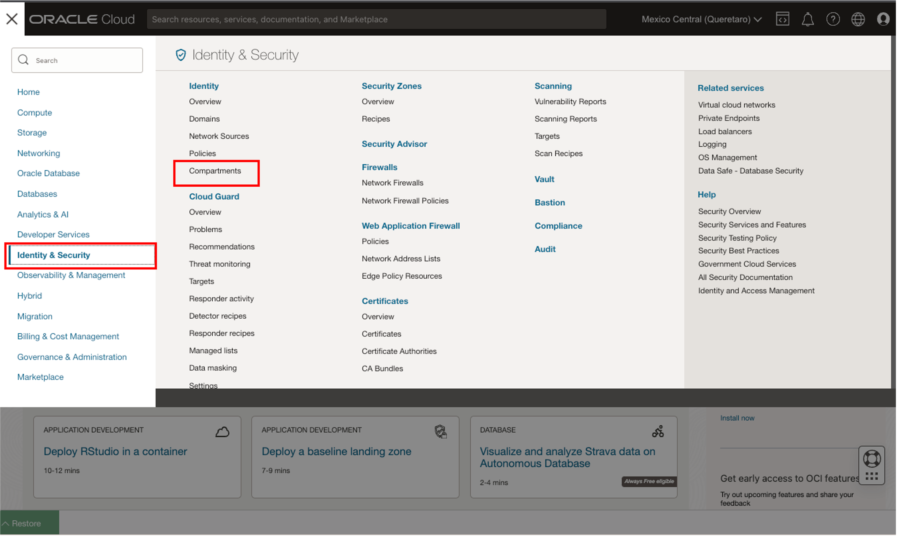

3. On Compartments Page, click on “Create Compartment”.
    

4. On Create Compartment, enter Name, Description, select Parent Compartment, and click on Create Compartment.
    

5. Completed Compartments
    

6. Now to work in your compartment, choose it from left side menu when you create services. Here a screenshot from “Compute/Instances”
    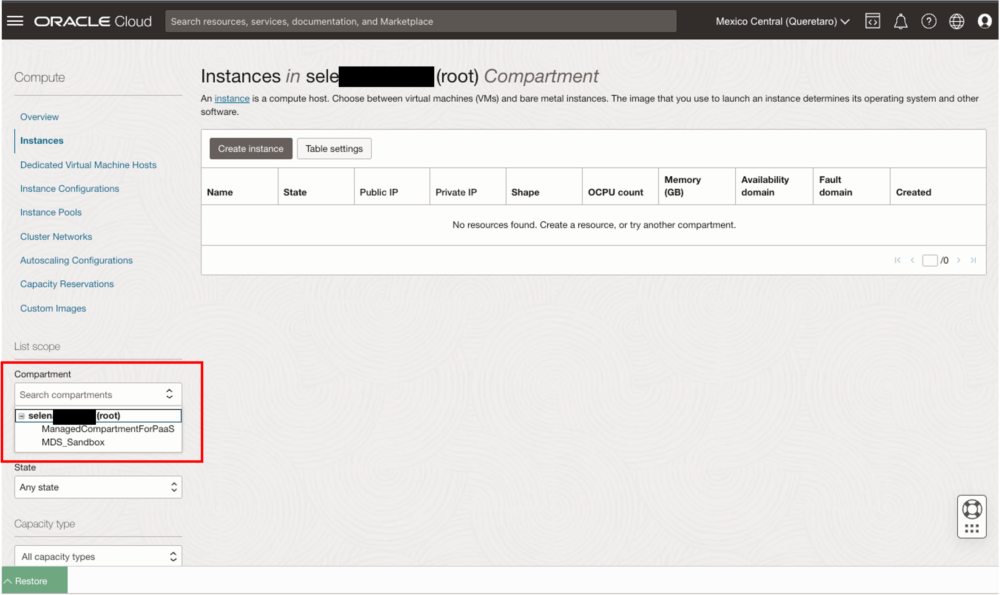

## Task: Troubleshooting: Windows Powershell SSH error on permissions 
1. In case you are using powershell and you receive an error like
    
    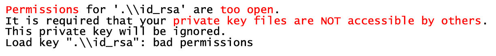

    Please use below commands to fix the permissions (please change full path with your path (e.g. New-Variable -Name Key -Value "C:\mysql\id_rsa"))

    ```
    <span style="color:green">powershell></span><copy>New-Variable -Name Key -Value "<full path>\id_rsa"</copy>
    ```

    Verify that ls command retrieve the right file:
    ```
    <span style="color:green">powershell></span><copy>ls $Key</copy>
    ```
    ```
    <span style="color:green">powershell></span><copy>Icacls $Key /c /t /Inheritance:d</copy>
    ```
    ```
    <span style="color:green">powershell></span><copy>Icacls $Key /c /t /Grant ${env:UserName}:F</copy>
    ```
    ```
    <span style="color:green">powershell></span><copy>TakeOwn /F $Key</copy>
    ```
    ```
    <span style="color:green">powershell></span><copy>Icacls $Key /c /t /Grant:r ${env:UserName}:F</copy>
    ```
    ```
    <span style="color:green">powershell></span><copy>Icacls $Key /c /t /Remove:g Administrator "Authenticated Users" BUILTIN\Administrators BUILTIN Everyone System Users</copy>
    ```
    ```
    <span style="color:green">powershell></span><copy>Icacls $Key</copy>
    ```
    ```
    <span style="color:green">powershell></span><copy>Remove-Variable -Name Key</copy>
    ```

    Then retry the ssh connection.

## Task: Troubleshooting: Lost private key for app-srv 
 If the private ssh keys to access your app-srv server is lost (because inside a broken laptop), the recovey is really time consuming and difficult.
 The best approach is to create a custom image of your server and use it to recreate the server.
1. Connect to your tenancy
2. Select “instances” from “Compute”
    

3. Select the app-srv server and show details
4. Take a note of the <span style="color:red">actual private IP address</span>!
    * If you forgot this part, you have to manually update the /etc/fstab file on each mysqlX instance, then remount the NFS share
    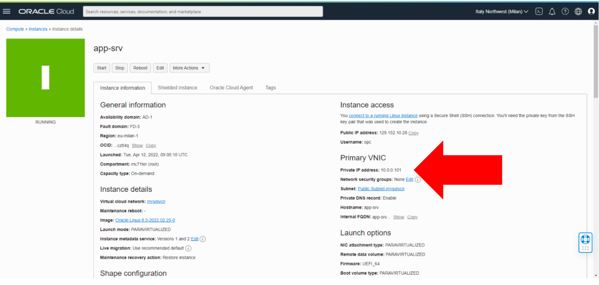

5. From the menu “More Actions” select “Create custom image”
    

6. Wait that the image is created
7. Select “custom images” and check that your image is available
    
8. <span style="color:red">If the image is not Available, not read the error and fix it before continuing</span>
9. Return to “Instances” and... have you saved the private IP?
    If not, save it now and then delete (“Terminate”) the existing app-srv
    
    

10. Go to “Custom images” and select your image
    
11. Deploy a new app-srv server with “Create Instance” button.
    * Use app-srv as name
    * Expand “Show Advanced Option” in network section and insert the previous private IP address
    * Create a new private key (<span style="color:red">SAVE IT !!!</span>)
    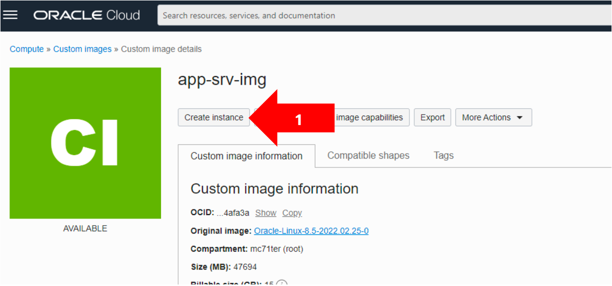
    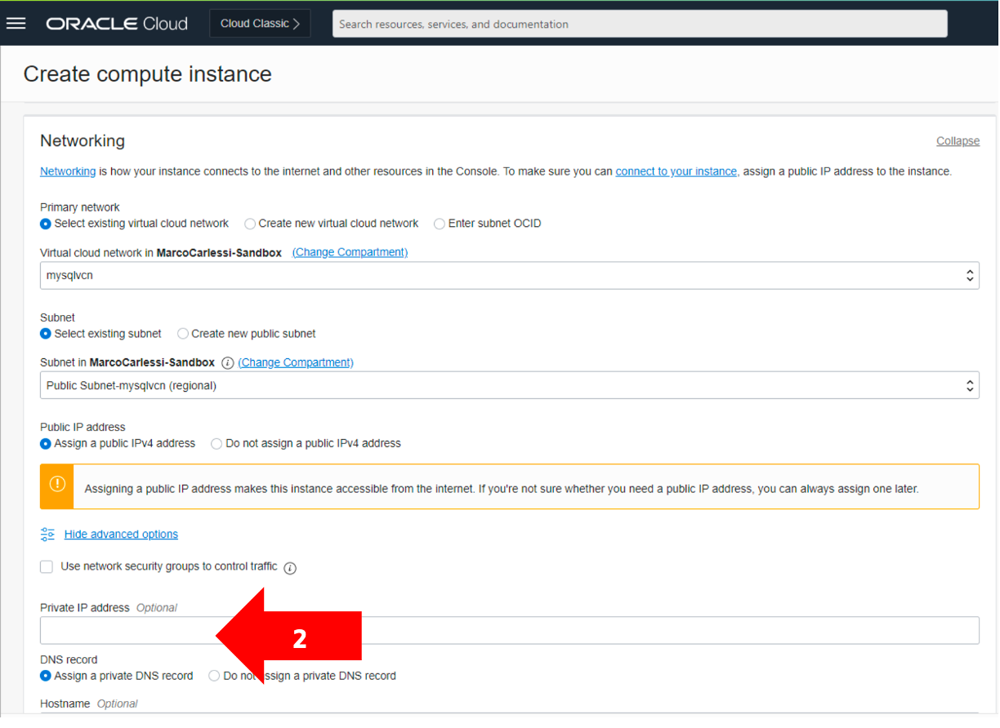
12. When the instance is available, reconnect with the <span style="color:red">NEW PUBLIC IP</span> and the <span style="color:red">NEW PRIVATE KEY!</span>
13. The content is the same as the lost server


## Acknowledgements
* **Author** - Marco Carlessi, Principal Sales Consultant
* **Contributors** -  Perside Foster, MySQL Solution Engineering, Selena Sánchez, MySQL Solutions Engineer
* **Last Updated By/Date** - Selena Sánchez, MySQL Solution Engineering, May 2023