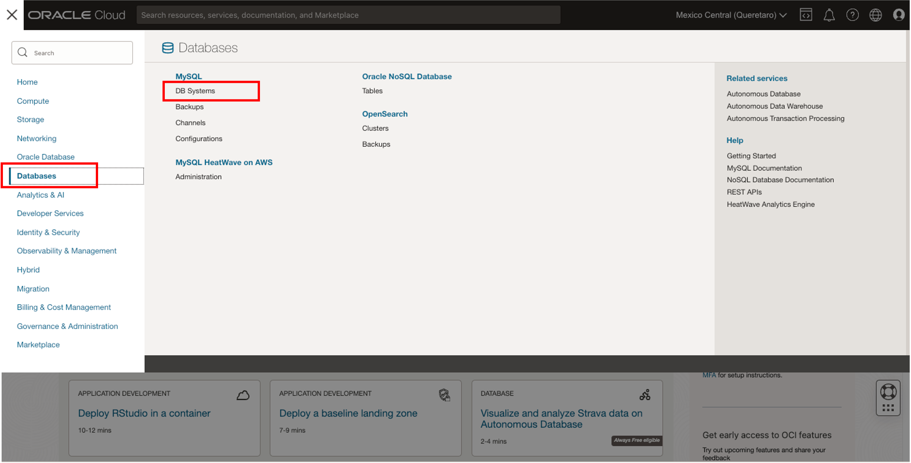
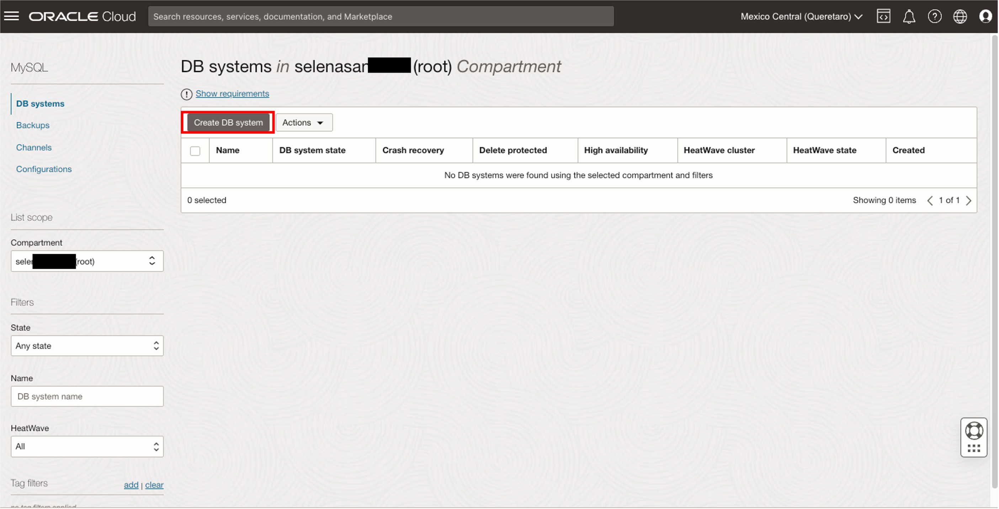
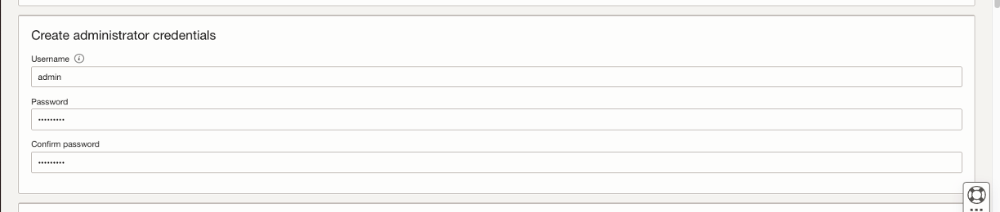
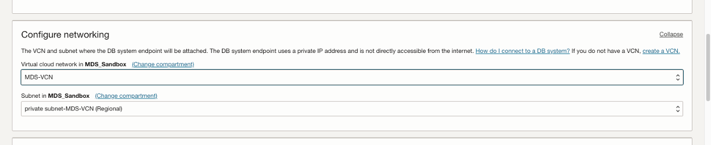
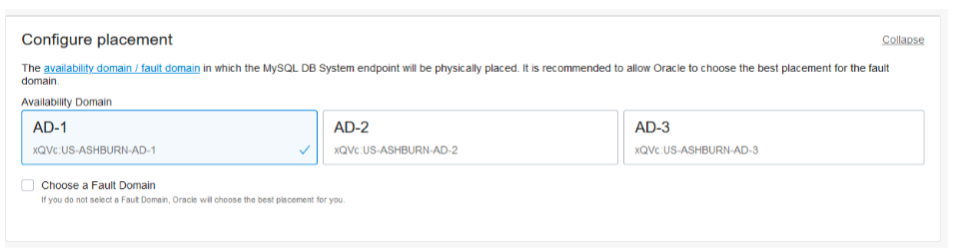
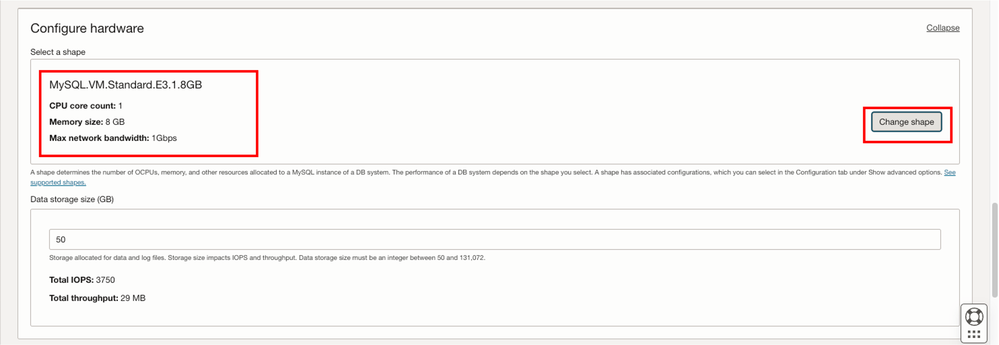
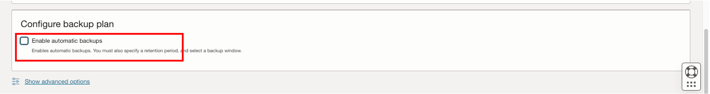
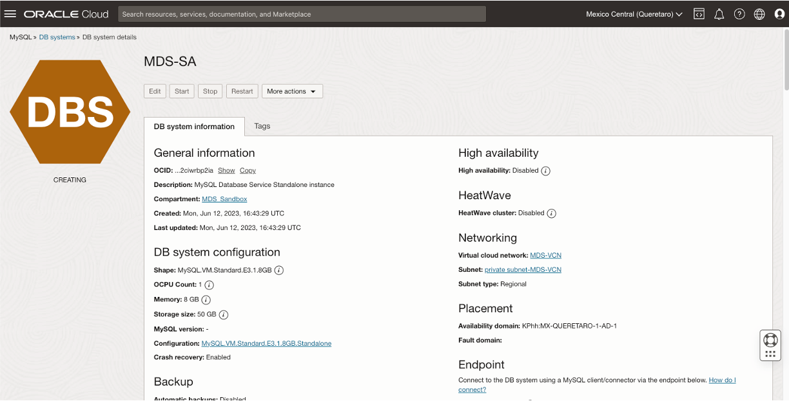
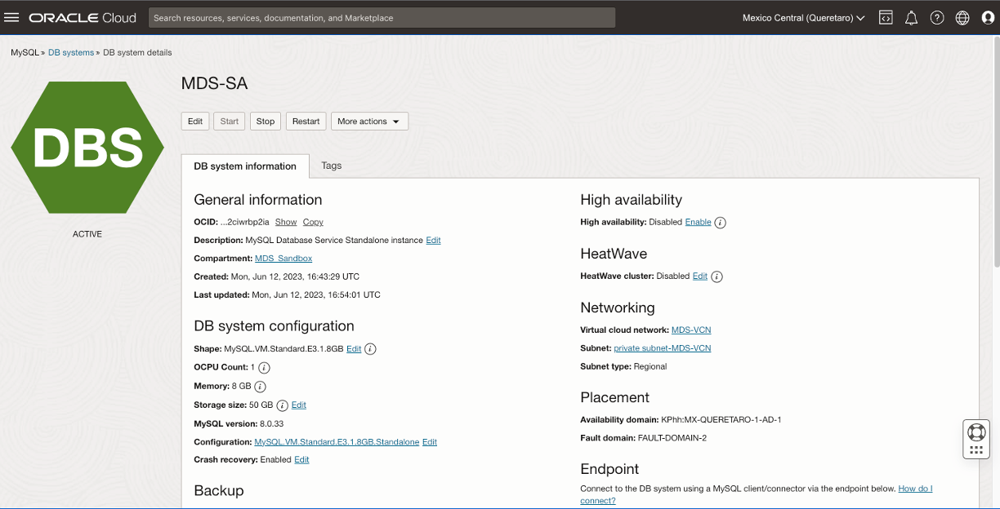

# MySQL HeatWave Database Service - DEMO

## Introduction
MySQL HeatWave is the only fully managed database service powered by the HeatWave in-memory query accelerator. It combines transactions, analytics, and machine learning services into one MySQL Database, delivering real-time, secure analytics without the complexity, latency, and cost of ETL duplication.

This lab is presented as demo, but below you have all the steps to replicate it.


Estimated Lab Time: 30 minutes

### Objectives
In this lab, you will:
* Configure, deploy and use MySQL Heatwave

> **Note:** 
  * We focus on a single instance

## Task 1: Deploy HeatWave
1. Login in your OCI tenancy dashboard
2. If are using a dedicated compartment, select it
3. On the Navigation Menu, select Databases -> MySQL, DB Systems.
    
4. Click Create MySQL DB System
    

5. Insert the required information to create our database service.
    * Basic information for the DB System:

        Create in compartment: (keep the default, root or yours)
        ```
        Name: <copy>MDS-SA</copy>
        ```
        ```
        Description: <copy>MySQL Database Service Standalone instance</copy>
        ```

        Keep “Standalone” selection

        
    * Create Administrator credentials
        ```
        Username: <copy>admin</copy>
        ```
        ```
        Password:<copy>Welcome1!</copy>
        ```
        ```
        Confirm Password:<copy> Welcome1!</copy>
        ```
        
    * Configure networking (keep the defaults)

        Virtual Cloud Network: MDS-VCN

        Subnet: Private Subnet-mysqlvcn (Regional)

        
    * Configure placement

        Availability Domain: (keep the default)

        Choose a Fault Domain: (keep unselected)

        

    * Configure hardware

        Select a Shape: (keep the default MySQL.VM.Standard.E3.1.8GB)

        Data Storage Size (GB): (keep default value 50)

        

    * Configure Backups

        Enable Automatic Backups: OFF

        
    * Expand “Show Advanced Options”.

        Select “Networking” tab and enter

        ```
        Hostname: <copy>mds-sa</copy>
        ```
        
    * Click the Create button

6. The state will be shown as Creating. The New MySQL DB System will be ready to use after a few minutes.
    
7. The state Active indicates that the DB System is ready to use. 

    Take a note of your private IP and FQDN in Endpoint section.
    

## Task 2: Use HeatWave
1. Now we can test the new service.

    If not already connected, connect to app-srv
    ```
    <span style="color:green">shell-app-srv$</span><copy>ssh -i <private_key_file> opc@<your_compute_instance_ip></copy>
    ```
2. Connect to your instance
    ```
    <span style="color:green">shell-app-srv$</span><copy>mysql -uadmin -p -h <mds_ip_address></copy>
    ```
3. Now we execute some commands to interact with our instance.
    * Show the database version, current_date, and user
        ```
        <span style="color:blue">mysql></span><copy>SELECT VERSION(), CURRENT_DATE, USER();</copy>
        ```
    * Create a database with a table
        ```
        <span style="color:blue">mysql></span><copy>CREATE DATABASE mydb;</copy>
        ```
        ```
        <span style="color:blue">mysql></span><copy>SHOW DATABASES;</copy>
        ```
        ```
        <span style="color:blue">mysql></span><copy>use mydb;</copy>
        ```
        ```
        <span style="color:blue">mysql></span><copy>CREATE TABLE mytable (id INT, PRIMARY KEY(id));</copy>
        ```
        ```
        <span style="color:blue">mysql></span><copy>INSERT INTO mytable VALUES(1);</copy>
        ```
        ```
        <span style="color:blue">mysql></span><copy>INSERT INTO mytable VALUES(2);</copy>
        ```
        ```
        <span style="color:blue">mysql></span><copy>SELECT * FROM mytable;</copy>
        ```


## Acknowledgements
* **Author** - Marco Carlessi, Principal Sales Consultant
* **Contributors** -  Perside Foster, MySQL Solution Engineering, Selena Sánchez, MySQL Solutions Engineer
* **Last Updated By/Date** - Selena Sánchez, MySQL Solution Engineering, May 2023