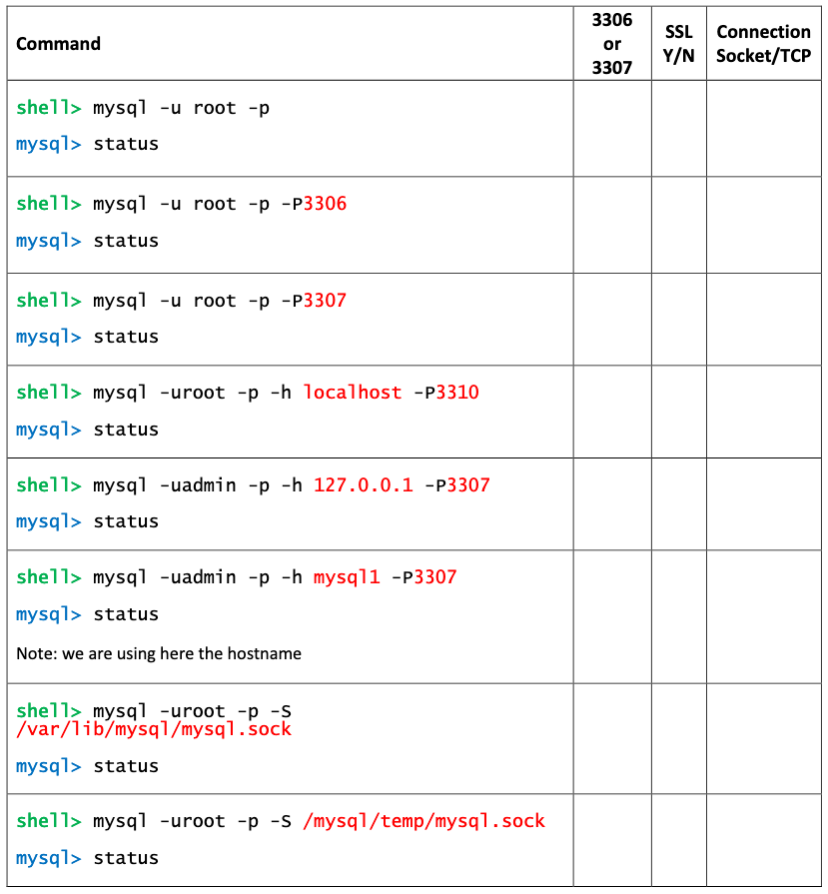

# Verify the new MySQL Installation on Linux and import test databases

## Introduction
In this lab you will verify and start using your new MySQL Installation

Estimated Lab Time: 20 minutes

### Objectives
In this lab, you will:
* Understand better how MySQL connection works   
* Install test databases for labs (world and employees)
* Have a look on useful statements

> **Note:** 
  * Server: mysql1

## Task 1: Understand MySQL Connections

1. If not already connected, connect to mysql1 server through app-srv
    ```
    <span style="color:green">shell-app-srv$</span><copy>ssh -i $HOME/sshkeys/id_rsa_mysql1 opc@mysql1</copy>
    ```
    
Please note that now you have 2 instances on the same server: one on  3306 (community) and one on 3307 (commercial).
  MySQL (as default) interpret localhost as socket and not the 127.0.0.1 TCP address.This may end with strange behaviors and errors.


  Here we practice connecting in various way and check what is working and what is not (note: port 3310 is intentionally wrong).

2. Use the command in table below to test different connection strings and check the result. If the result is not clear to you, please ask an explanation to your instructor. Please note that “-p” lowercase refers to password, “-P” uppercase refer to the TCP port.
Don’t be confused by the client version and check these lines, to understand “why” (not all are always available...)
* Current user:
* Connection:
* UNIX socket:
* TCP port:
* Server version:



## Task 2: Remove Community and import databases

1. Now that we better understood how to connect, we can remove the community installation and refresh PATH cache 
    ```
    <span style="color:green">shell-mysql1></span><copy>sudo yum remove mysql mysql-server</copy>
    ```

    ```
    <span style="color:green">shell-mysql1></span><copy>hash -r</copy>
    ```

5. Import the world database, that will be used later, from c:\workshop\databases\world. You can do it with mysql client
    ```
    <span style="color:green">shell-mysql1></span><copy>mysql -uadmin -p -P3307 -h mysql1 </workshop/databases/world/world.sql</copy>
    ```

6. Import the employees demo database that is in /workshop/databases folder.
    ```
    <span style="color:green">shell-mysql1></span><copy>cd /workshop/databases/employees</copy>
    ```
    ```
    <span style="color:green">shell-mysql1></span><copy>mysql -uadmin -p -P3307 -h mysql1 < ./employees.sql</copy>
    ```

## Task 3: Run SQL statements
Have a look to these useful SQL Statements:
    ```
    <span style="color:green">shell-mysql1></span><copy>mysql -uadmin -p -h mysql1 -P 3307</copy>
    ```
    ```
    <span style="color:blue">mysql></span><copy>SHOW VARIABLES LIKE "%version%";</copy>
    ```
    ```
    <span style="color:blue">mysql></span><copy>SELECT table_name, engine FROM INFORMATION_SCHEMA.TABLES WHERE engine <> 'InnoDB';</copy>
    ```
    ```
    <span style="color:blue">mysql></span><copy>SELECT table_name, engine FROM INFORMATION_SCHEMA.TABLES WHERE engine = 'InnoDB';</copy>
    ```
    ```
    <span style="color:blue">mysql></span><copy>SELECT table_name, engine FROM INFORMATION_SCHEMA.TABLES where engine = 'InnoDB' and table_schema not in ('mysql','information_schema', 'sys');</copy>
    ```
    ```
    <span style="color:blue">mysql></span><copy>SELECT ENGINE, COUNT(*), SUM(DATA_LENGTH)/ 1024 / 1024 AS 'Data MB', SUM(INDEX_LENGTH)/1024 / 1024 AS 'Index MB' FROM information_schema.TABLEs group by engine;</copy>
    ```
    ```
    <span style="color:blue">mysql></span><copy>SELECT table_schema AS 'Schema', SUM( data_length ) / 1024 / 1024 AS 'Data MB', SUM( index_length ) / 1024 / 1024 AS 'Index MB', SUM( data_length + index_length ) / 1024 / 1024 AS 'Sum' FROM information_schema.tables GROUP BY table_schema ;</copy>
    ```

The “\G” is like “;” with a different way to show results
    ```
    <span style="color:blue">mysql></span><copy>SHOW GLOBAL VARIABLES\G</copy>
    ```
    ```
    <span style="color:blue">mysql></span><copy>SHOW GLOBAL STATUS\G</copy>
    ```
    ```
    <span style="color:blue">mysql></span><copy>SHOW FULL PROCESSLIST;</copy>
    ```
    ```
    <span style="color:blue">mysql></span><copy>SHOW ENGINE INNODB STATUS\G</copy>
    ```


## Acknowledgements
* **Author** - Marco Carlessi, Principal Sales Consultant
* **Contributors** -  Perside Foster, MySQL Solution Engineering, Selena Sánchez, MySQL Solutions Engineer
* **Last Updated By/Date** - Selena Sánchez, MySQL Solution Engineering, May 2023
