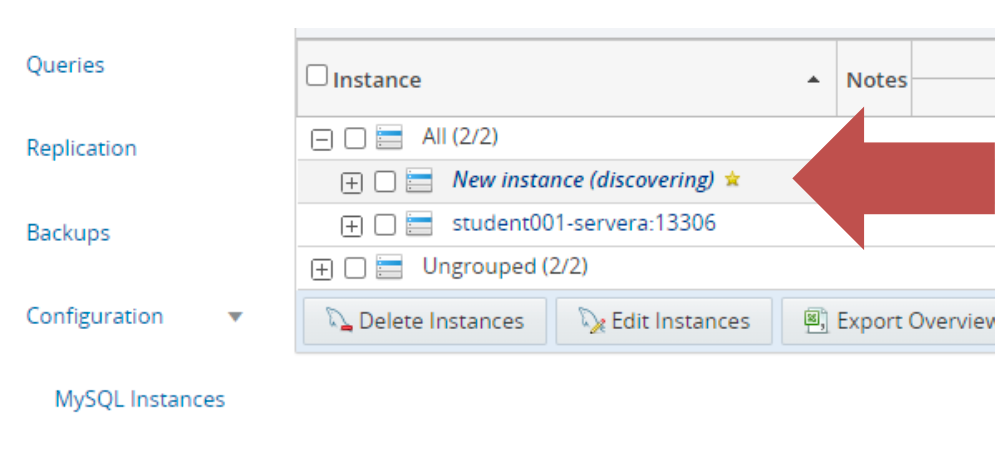
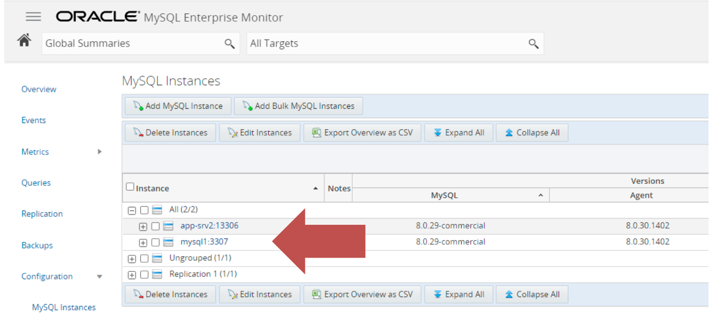
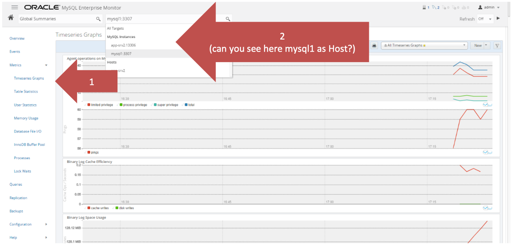
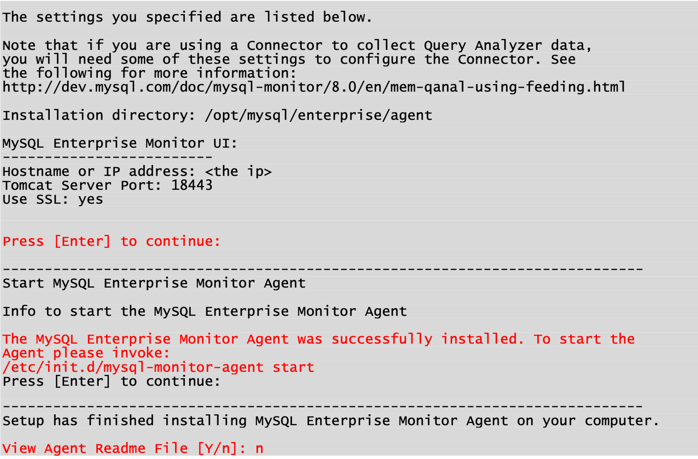
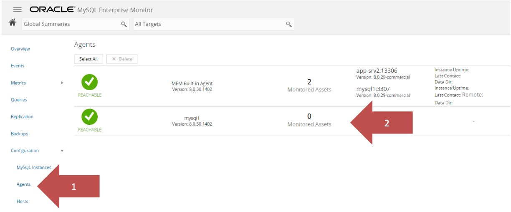

# MySQL Enterprise Monitor

## Introduction
MySQL Enterprise Monitor is a companion product to MySQL Server that enables monitoring of MySQL instances and their hosts, notification of potential issues and problems, and advice on how to correct issues. MySQL Enterprise Monitor can monitor all types of installation, from a single MySQL instance to large farms of database servers. MySQL Enterprise Monitor is a web-based application, enabling you to monitor MySQL instances on your network or on a cloud service. 

In this lab you will install the MySQL Enterprise Service Manager and Agent.

Estimated Lab Time: 35 minutes


### Objectives
In this lab, you will:
* Install Monitor Service Manager
* Install Monitor Agent


## Task 1: Install Monitor Service Manager
> **Note:**
 * Server: App-srv for Enterprise Monitor

 


- If not already connected to the app-srv then connect with your SSH client using the public IP and the provided ssh Example of connections from Linux, MAC, Windows Powershell
    ```
    <span style="color:green">shell></span><copy> ssh -i id_rsa_app-srv opc@<public_ip></copy>
    ```

- On Oracle Linux8/RHEL8/Centos 8 is please install ncurses-compat-libs
    ```
    <span style="color:green">shell-mysql1></span><copy> sudo yum install -y ncurses-compat-libs </copy>
    ```
1. Now we install the service. If not already connected, connect to app-srv with your SSH client
2. Install the MySQL Enterprise Monitor Service Manager on app-srv
    ```
    <span style="color:green">shell-app-srv$</span><copy>cd /workshop/linux/monitor</copy>
    ```
    ```
    <span style="color:green">shell-app-srv$</span><copy>sudo ./mysqlmonitor-8.0.*-linux-x86_64-installer.bin</copy>
    ```
    Here a summary of the installer questions:
    (Except for the Password Entry [ using Welcome1! ], all other INPUTs are DEFAULT – Just hit <ENTER>)

    
    
    
3. On app-srv: Check the status of the MySQL Monitor
    ```
    <span style="color:green">shell-app-srv$</span><copy>sudo /opt/mysql/enterprise/monitor/mysqlmonitorctl.sh status</copy>
    ```
4. On app-srv: After the successful installation connect to the newly installed service with a web browser on the address from your laptop (please use the public IP and be patient, startup may require few minutes depending on VM resources)
    ```
    <copy>https://<app-srv_public_ip>:18443</copy>
    ```
    

5. Fill then Admin user and Agent user settings (if you like change the password with stronger ones) 
    ```
    Admin user:<copy>admin</copy>
    ```
    ```
    Admin password:<copy>Welcome1!</copy>
    ```
    ```
    Agent user:<copy>agent</copy>
    ```
    ```
    Agent password:<copy>Welcome1!</copy>
    ```

6. Click ‘Complete Setup’ button
7. Choose your time zone and keep “English” for locale
    
8. Now you are logged in and can configure to monitor your MySQL instances
9. Connect your MEM to use mysql-advanced in agentless mode
    * On left side menu expand “Configuration” and select “MySQL Instances”. Click button “Add MySQL Instance”
    
10. Insert connection data to your instance on mysql1
    ```
    Monitor From:<copy>MEM Built-in Agent</copy>
    Connect Using:<copy>TCP/IP</copy>
    Instance Address:<copy>mysql1</copy>
    Port:<copy>3307</copy>
    Admin User:<copy>admin</copy>
    Admin password:<copy>Welcome1!</copy>
    Auto-Create Less Privileged Users:<copy>No</copy>
    ```
    
11. Now confirm with the button “Add Instance”
12. You will see your instance in discovering
    
13. After few seconds refresh your web browser page and you will see your instance connected
    
14. Browse the interface and watch events
    
15. 15. Browse the interface select from left menu “Metrics\Timeseries Graphs”. 
    Then select your mysql instance and watch some graphs.
    
16. Are you able to see your mysql1 in the list of hosts? Why not?


## Task 2: Install Monitor Agent
> **Note:**
 * Servers:
    * App-srv for Enterprise Monitor
    * Mysql1 for Enterprise Agent
 * Make sure to note down the following:
    * app-srv Public IP address 
    The Public IP Address is used on your Local Browser https://< public\_ip >:18443
    * app-srv Private IP address (Used during Agent configuration)


1. If not already connected, connect to app-srv and retrieve the Private IP with the OCI dashboard or the linux command. This IP will be used to connect the agent to the Monitor Service
    ```
    <span style="color:green">shell-app-srv$</span><copy>ifconfig | grep 10.0.10</copy>
    ```

    Write down the App-srv PRIVATE ip (client_ip)
2. <span style="color:red">On mysql1:</span> Install the MEM agent and configure it
    Here a summary of the questions (from command installation in linux). Note Linux requires a manual first start
    ```
    <span style="color:green">shell-mysql1></span><copy>cd /workshop/linux/agent</copy>
    ```
    ```
    <span style="color:green">shell-mysql1></span><copy>sudo ./mysqlmonitoragent-8.0.*-linux-x86-64bit-installer.bin</copy>
    ```

    
    
    
3. Start the agent
    ```
    <span style="color:green">shell-mysql1></span><copy>sudo /etc/init.d/mysql-monitor-agent start</copy>
    ```
4. Return to your web browser and check the agent connection from left menu “Configuration\Agents”
    
5. Use now the new agent to monitor your mysql-advanced connection
    * left menu Configuration\MySQL Instances
    * check the box of mysql1:3307
    * click “Edit instances” button
    
    * Select the tab “Connection Settings”
    * Choose the new agent and reinsert admin password (keep other settings)
        
        Monitor From: mysql1
        ```
        Admin password:<copy>Welcome1!</copy>
        ```
    

6. Click “Edit Instance” button
7. Now do you see the host mysql1 as target?

## Task 3: Add a workload (Optional)
1. Don’t install the agent on mysql2 and mysql3.
    Add mysql2 and mysql3 as you did for mysql1 with monitoring from MEM Bult-in Agent”
2. Check replication statistics
    * In “Global Summaries” menu select “Replication 1”
    * In “All Targets” box select your “GR cluster” (scroll down the list to find it)
    * Select Replication from left menu
    

3. Visualize replication topology: select from left menu “Topology”
    * As target select your GR cluster
    * From left menu choose Topology
    
4.  Add some load on your server to watch graphics change
    * From app-srv run the test tool “mysqlslap”, available in all MySQL server and client installations (below command is expected to run for a long time, to give you the time to see the peak):
        ```
        <span style="color:green">shell-app-srv$</span><copy>mysqlslap --user=admin --password --host=app-srv --port=6446 --concurrency=20 --iterations=30 --number-int-cols=5 --number-char-cols=20 --auto-generate-sql --auto-generate-sql-guid-primary</copy>
        ```
    * Check behavior in MEM, can you see the peaks?


## Learn More
* https://dev.mysql.com/doc/mysql-monitor/8.0/en/mem-install-tuning.html
* https://dbtut.com/index.php/2018/10/25/installation-of-mysql-enterprise-monitor/

## Acknowledgements
* **Author** - Marco Carlessi, Principal Sales Consultant
* **Contributors** -  Perside Foster, MySQL Solution Engineering, Selena Sánchez, MySQL Solutions Engineer
* **Last Updated By/Date** - Selena Sánchez, MySQL Solution Engineering, May 2023
