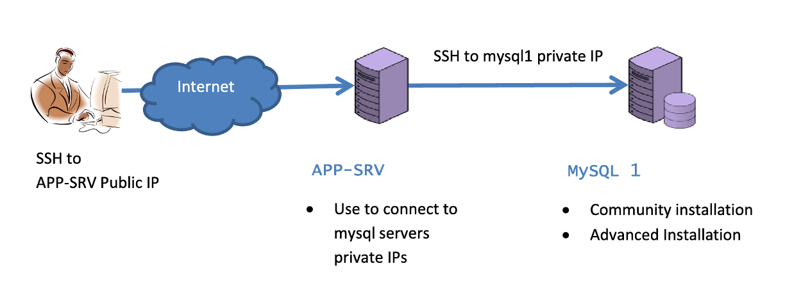
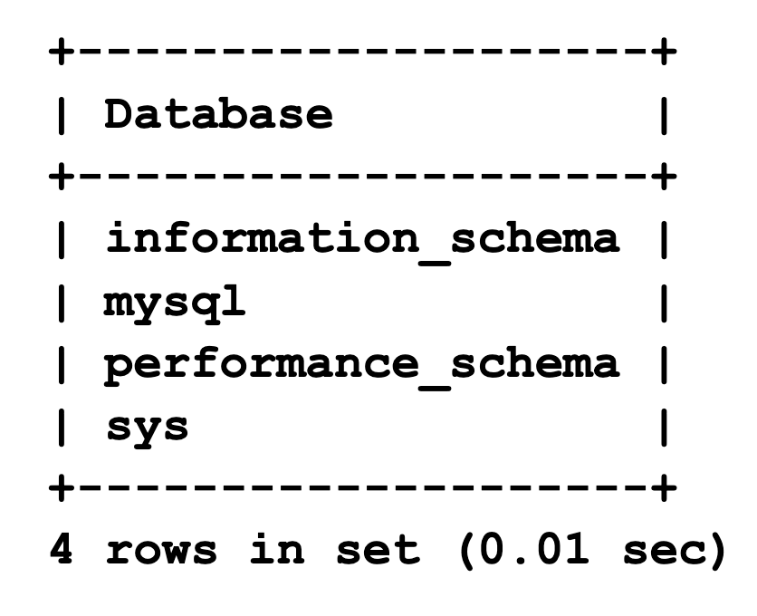

# Installation of MySQL Community 

## Introduction
 In this lab you will install MySQL Community, this because by default RedHat installs MariaDB so, we update the repository to install the original MySQL.



Estimated Lab Time: 30 minutes


### Objectives

In this lab, you will be guided through the following tasks: 
* Installation of MySQL 8 (Community) on Oracle Linux 8. 


> **Note:** 
  * Server: mysql1
  * We call the instance installed here <span style="color:red">mysql-gpl</span>

## Task 1: Install MySQL Community

1. Open an SSH client to app-srv

2. Connect to <span style="color:green">shell-mysql1</span>

    ```
    <span style="color:green">shell-app-srv$</span><copy> ssh -i $HOME/sshkeys/id_rsa_mysql1 opc@mysql1 </copy>
    ```

4. Which MySQL packages are installed on your Linux?

    ```
    <span style="color:green">shell-mysql1></span><copy> sudo rpm -qa | grep mysql </copy>
    ```
5. What happens when you try to install the mysql binaries with RedHat repositories? 
Run this command but <span style="color:red"> don’t confirm </span>

    ```
    <span style="color:green">shell-mysql1></span><copy> sudo yum install mysql </copy>
    ```

    As you have seen, above command try to install MariaDB sw. Each distribution has its own repositories and different choices for the packages to install.

6. Because a non-updated PGPkey please run

    ```
    <span style="color:green">shell-mysql1></span><copy> sudo rpm --import https://repo.mysql.com/RPM-GPG-KEY-mysql-2022 </copy>
    ```

7. Oracle Linux 8 already have the official MySQL repository, but to show you how to do it, we install it from the package downloading from https://dev.mysql.com/downloads/
    
    ```
    <span style="color:green">shell-mysql1></span><copy> wget https://dev.mysql.com/get/mysql80-community-release-el8-1.noarch.rpm </copy>
    ```

    ```
    <span style="color:green">shell-mysql1></span><copy> sudo yum -y install mysql80-community-release-el8-1.noarch.rpm </copy>
    ```
8. Update repository database with the new references
    ```
    <span style="color:green">shell-mysql1></span><copy> sudo yum repolist all </copy>
    ```

9. Repeat the command above to install mysql-client (without using the mysql module id default repositories, to force the usage of MySQL ones) and note the different packages

    ```
    <span style="color:green">shell-mysql1></span><copy> sudo yum module disable mysql </copy>
    ```

    ```
    <span style="color:green">shell-mysql1></span><copy> sudo yum install mysql </copy>
    ```

10. If only mysql packages are shown, confirm the installation.

## Task 2: Install MySQL Server

1. Install mysql-server
    ```
    <span style="color:green">shell-mysql1></span><copy> sudo yum install mysql-server </copy>
    ```

2. Because MySQL is automatically installed you can use OS command for service management, for example to check if it’s already started
    ```
    <span style="color:green">shell-mysql1></span><copy> sudo systemctl status mysqld </copy>
    ```

3. Start MySQL if not started
    ```
    <span style="color:green">shell-mysql1></span><copy> sudo systemctl start mysqld </copy>
    ```

    ```
    <span style="color:green">shell-mysql1></span><copy> sudo systemctl status mysqld </copy>
    ```

## Task 3: Change root password
1. Check the content of my.cnf, that is in default folder for linux OS and note the following info (lines that start with “#”are just comments)
    * Where is the database and the error log (mysqld.log) stored?
    * Check if there are error for the instance looking in the error log file

    ```
    <span style="color:green">shell-mysql1></span><copy>sudo cat /etc/my.cnf </copy>
    ```

2. Starting from MySQL 5.7 the default installation of MySQL Server generates a one-time password. You find it in error log notes above 

    ```
    <span style="color:green">shell-mysql1></span><copy>sudo grep 'temporary' /var/log/mysqld.log </copy>
    ```

3. Login to MySQL using password retrieved in previous step

    ```
    <span style="color:green">shell-mysql1></span><copy>mysql -uroot -p -h localhost </copy>
    ```
4. Try to run a command and write down the error message

    ```
    <span style="color:blue">mysql></span><copy>status</copy>
    ```
5. Change root password

    ```
    <span style="color:blue">mysql></span><copy> ALTER USER 'root'@'localhost' IDENTIFIED BY 'Welcome1!';</copy>
    ```
6. Retry command above, now it works

    ```
    <span style="color:blue">mysql></span><copy>status; </copy>
    ```
7. Which databases are installed by default?

    ```
    <span style="color:blue">mysql></span><copy> show databases; </copy>
    ```
    

8. To see which version of MySQL you are using submit the command

    ```
    <span style="color:blue">mysql></span><copy>show variables like "%version%"; </copy>
    ```
9. Check default users in standard installation

    ```
    <span style="color:blue">mysql></span><copy>select user, host from mysql.user where user='root'; </copy>
    ```
10. Logout as ‘root’ and connect as admin

    ```
    <span style="color:blue">mysql></span><copy> exit </copy>
    ```

## Learn More
* https://dev.mysql.com/doc/mysql-yum-repo-quick-guide/en/
* https://dev.mysql.com/doc/refman/8.0/en/validate-password.htm

## Acknowledgements
* **Author** - Marco Carlessi, Principal Sales Consultant
* **Contributors** -  Perside Foster, MySQL Solution Engineering, Selena Sánchez, MySQL Solutions Engineer
* **Last Updated By/Date** - Selena Sánchez, MySQL Solution Engineering, May 2023
